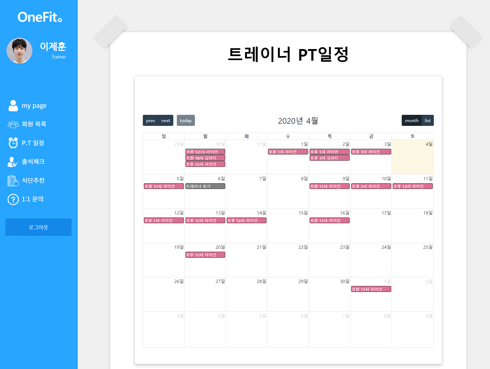
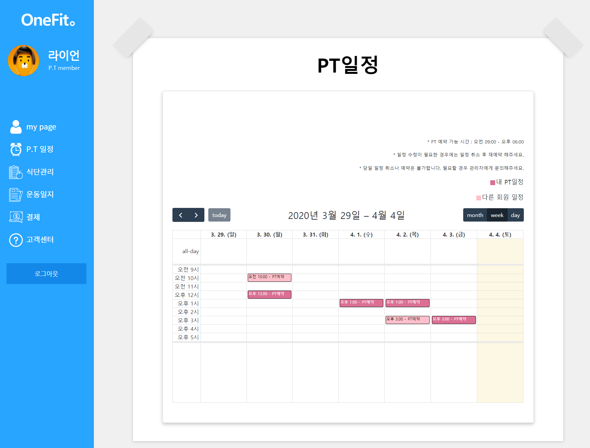
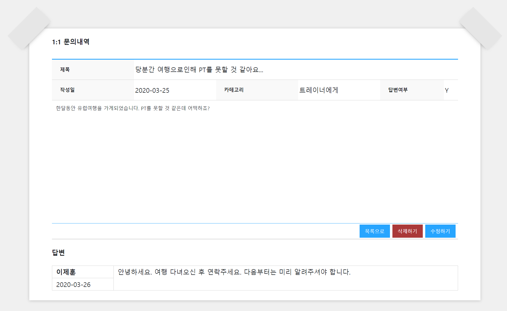
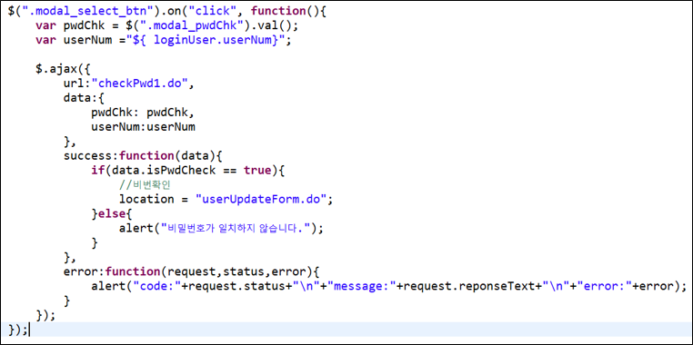
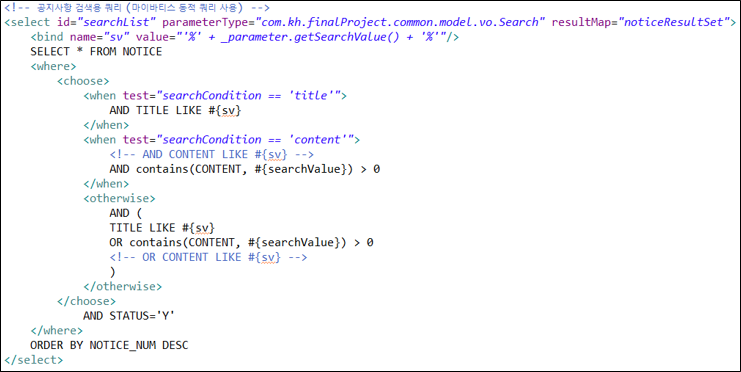

# onefit
* 원핏은 피트니스 관리 프로그램입니다. 아날로그식의 헬스장 운영을 관리하기 편한 프로그램으로 만들었습니다. 일정관리, 회원관리, 트레이너관리, 예약기능이 제공됩니다.
* 제작기간 : 2개월

## Supported Modules
* OS : window10
* 개발환경 : Java 1.8, eclipse 2018-09, oracle 11g R2, SpringFramework 5.2.2, STS 3.9.11, HTML5, CSS, JavaScript, Ajax
* DB : Oracle 11g, sql Developer
* WAS : Apache Tomcat 8
* DB-design Tool : Erdcloud
* UI-design Tool : kakaoOven
* Library : MyBatis, Maven, Bootstrap4, jQuery 3.4.1
* version control system : GitHub
* API : quillAPI, fullCalendar4.3.1, 1:1문의 채팅 api, 카카오 결제 api

* **뷰 및 코드 소개** - Visualize request count and response patterns over time to identify potential problems. Transactions can be selected for additional detail by **dragging over the chart**.

  
  
  
  
  
  
  

